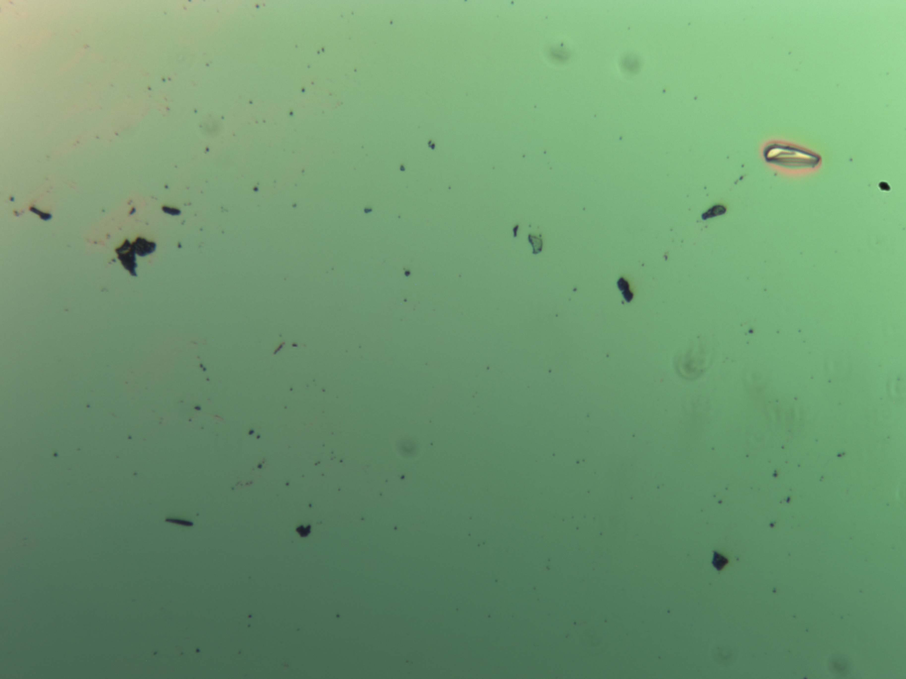
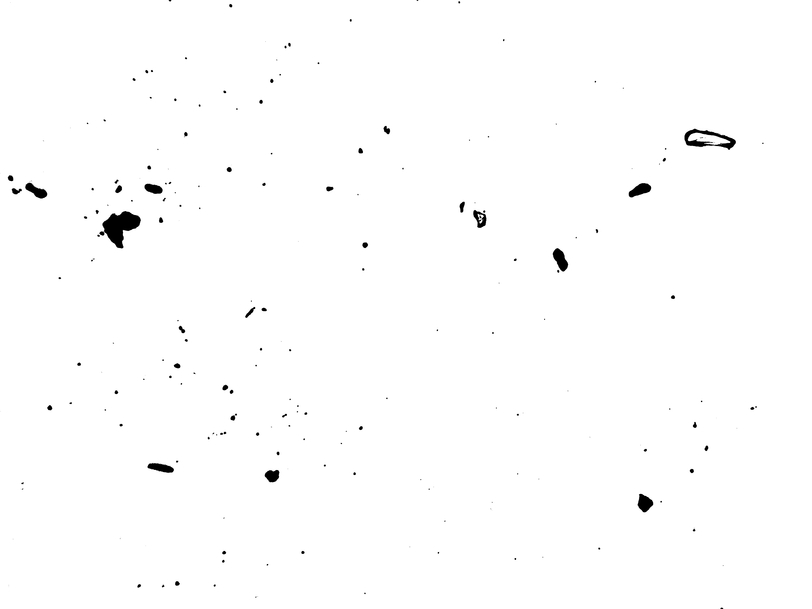
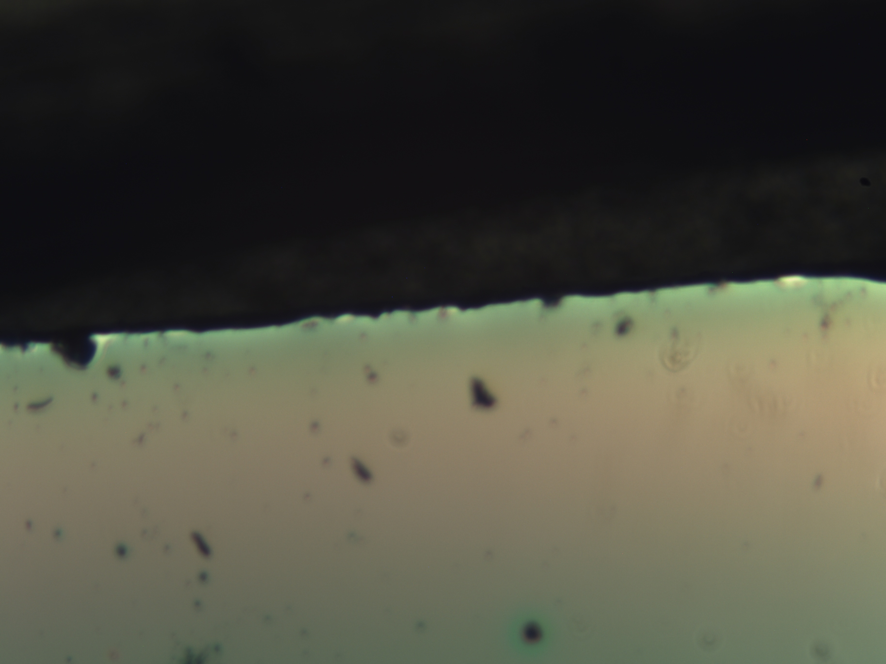

# senior-design-project-28-wafer-defect-detection
This project aims to process a 2D image taken from a microscope (and eventually from a 3D printer design wafer defect
detecting system) in order to find all wafer defects and their corresponding locations. There are three Python scripts 
located in this repository, which will be discussed individually below.

The first script, preprocess_images.py, will convert wafer images located in the directory titled
"defective" into a black and white image. This will occur by first converting the image into a grayscale format, 
then removing the gradient and camera lens particles, which you can see in the directory titled "clean", and converting
the image into a black and white format based on a predetermined threshold value. 
Disclaimer: Preprocessing does not work very well for 50X and 100X magnification images, but works as expected on all 
other magnifications.

The second script, stats.py, will identify all wafer defects on said black and white image and then display 
relevant statistics of the image on the console based on an image name provided by the user. There are currently two
different methods to generate these statistics. One of them is simply by counting the pixels within the array to
identify whether it is a defect or clean. However, this method will not take into account the edges of the defect, since
those are also black but not a wafer defect. To fix that issue, I am using the findContours() method found in the
opencv-python library, which will connect defective pixels together to form singular defects. This method also poses its
own problems, though. Although it does not count edges as actually defective, due to the minimum and maximum size 
limitations that I have given to identify whether a region is considered a defect or not, it tends to create more 
defective pixels in order to smooth defects together, particularly those that are oddly-shaped or joined together.
However, finding contours of an image is definitely a worthwhile means of generating statistics of the image on a 
per-defect basis, such as counting all defects, finding where the coordinates of all defects are, and getting the
smallest and largest defect size. I will present the pros and cons of both methods in three cases of defect images below.

The last script, cnn.py, is currently in work-in-progress. It aims to classify wafer defects based on a neural network
called a Convolutional Neural Network. However, since this is one of the last priorities of the project, this is not
currently in active development; rather, it will be worked on once we are able to generate all relevant statistics
discussed above.

Future goals of this project are to stitch images of a single magnification together to create an overall wafer image
before starting to preprocess and generate the statistics of said image.

Below is an image of a clean wafer, which shows the image distortion coming from the camera lens and color gradient,
as well as three cases of sample wafer defects. Each of the defective images will show the original image, the image after
preprocessing, and the statistics generated of that image after preprocessing them. 

# Clean wafer image


# First case: Center image (less defects)

# Defective wafer before processing image


# Defective wafer after processing image


# Console output
```
Welcome to the wafer image defect statistical generator!
What image magnification would you like to see statistics of? (5X, 10X, 20X)
20x
You entered a magnification of 20X.
What image would you like to generate statistics of?
ox9 quadrant3 20x take1.jpg

Generating statistics of OX9 QUADRANT3 20X TAKE1.JPG...

Number of pixels in image: 10017440
Number of defect pixels in image (in array itself): 29166
Number of defect pixels in image (using contours): 29976
Percent error between defect pixels in array and contours: 2.78%
Percentage of defect pixels in image (in array itself): 0.29%
Percentage of defect pixels in image (using contours): 0.3%
Number of defects in image: 4
Coordinates for all defects: [[2507, 1912], [1664, 1243], [1423, 928], [1842, 316]]
Smallest defect size (in pixels): 30
Largest defect size (in pixels): 29732
Total time: 1.52 seconds
Exit? (Y/N)
y
```
# Second case: Center image (more defects)

# Defective wafer before processing image


# Defective wafer after processing image


# Console output
```
Welcome to the wafer image defect statistical generator!
What image magnification would you like to see statistics of? (5X, 10X, 20X)
5X
You entered a magnification of 5X.
What image would you like to generate statistics of?
5X_PARTICLE6.jpg

Generating statistics of 5X_PARTICLE6.JPG...

Number of pixels in image: 10017440
Number of defect pixels in image (in array itself): 57708
Number of defect pixels in image (using contours): 78525
Percent error between defect pixels in array and contours: 36.07%
Percentage of defect pixels in image (in array itself): 0.58%
Percentage of defect pixels in image (using contours): 0.78%
Number of defects in image: 133
Coordinates for all defects: [[3250, 2736], [735, 2637], [967, 2634], [625, 2636], [797, 2625], [1204, 2540], 
[1006, 2523], [2321, 2514], [1974, 2487], [1363, 2485], [1009, 2487], [2697, 2468], [3125, 2385], [2976, 2257], 
[2906, 2262], [101, 2174], [1596, 2130], [1227, 2140], [3115, 2119], [1462, 2094], [720, 2102], [797, 2077], 
[1249, 2040], [2905, 2025], [3179, 2018], [1369, 1976], [939, 1971], [997, 1951], [1159, 1953], [1013, 1947], 
[1624, 1927], [1303, 1915], [545, 1912], [3128, 1913], [1051, 1879], [2330, 1866], [1280, 1870], [1062, 1865], 
[1377, 1860], [3388, 1837], [3403, 1831], [1342, 1827], [226, 1836], [317, 1814], [3158, 1806], [522, 1765], 
[1043, 1763], [1012, 1743], [817, 1727], [766, 1695], [876, 1679], [1152, 1645], [798, 1645], [356, 1638], [734, 1620], 
[1306, 1575], [1174, 1571], [838, 1531], [2219, 1497], [1969, 1486], [818, 1483], [1188, 1391], [1127, 1402], 
[3030, 1338], [268, 1251], [2512, 1221], [1636, 1212], [413, 1171], [2320, 1167], [2524, 1166], [1645, 1102], 
[444, 1060], [461, 1049], [2687, 1039], [725, 992], [385, 978], [2163, 976], [2162, 983], [542, 1023], [2180, 952], 
[2162, 983], [437, 953], [899, 937], [812, 925], [2081, 929], [594, 902], [739, 897], [73, 858], [416, 849], 
[1485, 849], [530, 853], [690, 848], [2883, 856], [1188, 828], [746, 825], [162, 853], [764, 823], [525, 816], 
[48, 802], [1814, 758], [1033, 763], [672, 754], [2990, 720], [1222, 691], [2996, 669], [1623, 677], [3197, 632], 
[837, 603], [3202, 626], [1741, 583], [394, 555], [470, 540], [1066, 490], [899, 474], [1176, 458], [789, 448], 
[678, 438], [1012, 413], [2681, 367], [1223, 364], [603, 357], [1261, 335], [684, 319], [660, 321], [1434, 283], 
[836, 262], [1285, 210], [1303, 201], [2268, 180], [1579, 91], [1038, 25], [2068, 10], [764, 3]]
Smallest defect size (in pixels): 21
Largest defect size (in pixels): 15294
Total time: 1.34 seconds
Exit? (Y/N)
y
```

# Third case: Edge image

# Defective wafer before processing image


# Defective wafer after processing image


# Console output
```
Welcome to the wafer image defect statistical generator!
What image magnification would you like to see statistics of? (5X, 10X, 20X)
5x
You entered a magnification of 5X.
What image would you like to generate statistics of?
5x_botedge.jpg

Generating statistics of 5X_BOTEDGE.JPG...

Number of pixels in image: 10017440
Number of defect pixels in image (in array itself): 4740638
Number of defect pixels in image (using contours): 52876
Percent error between defect pixels in array and contours: 98.88%
Percentage of defect pixels in image (in array itself): 47.32%
Percentage of defect pixels in image (using contours): 0.53%
Number of defects in image: 25
Coordinates for all defects: [[285, 2724], [809, 2695], [895, 2678], [2195, 2610], [814, 2492], [837, 2382], 
[503, 2275], [832, 2249], [236, 2201], [118, 2166], [1492, 1944], [582, 1811], [66, 1677], [162, 1670], [390, 1637], 
[64, 1601], [1988, 1630], [1536, 1550], [591, 1514], [473, 1535], [858, 1464], [1281, 1342], [3403, 1335], 
[2574, 1348], [3568, 750]]
Smallest defect size (in pixels): 79
Largest defect size (in pixels): 9138
Total time: 1.57 seconds
Exit? (Y/N)
y
```

# Results
The preprocessing between both images worked fairly well. It was able to grab almost all noticeable defects into a black
and white image. From the image statistics, though, there seems to be a much bigger story to tell. In the first case,
it seems like both methods were comparable in counting defect pixels, since there was only a 2.78% difference in pixel
count. The number of defects is also accurate at 4, as well as their corresponding locations. In the second case,
though, the two different methods have captured somewhat different data between the number of defective pixels in the
image. The number of defective pixels in the contour method is about 20,000 more than the array method, representing a
whopping 36.07% difference between the two methods. Moreover, although it would be a massively tedious task to count
all defects on the image, I do believe that the contour method is working somewhat correctly, as it has detected over
100 different defects. This proves how the contour method does have some flaws over the array method in terms of
counting defective pixels. Finally, the third case shows how useful the contour method can be over the array method.
From the image, you can see a black bar covering half of the image, which shows that the image was taken near an edge
of the wafer. With the array method, it will count all pixels that are defective, regardless of edge or not, whereas
the contour method will only count defective pixels based on the size of the defect itself. Therefore, the contour
method's calculation of defective pixels, although slightly inaccurate from the previous image, are far more accurate
than the array method's calculation of defective pixels in this case.


