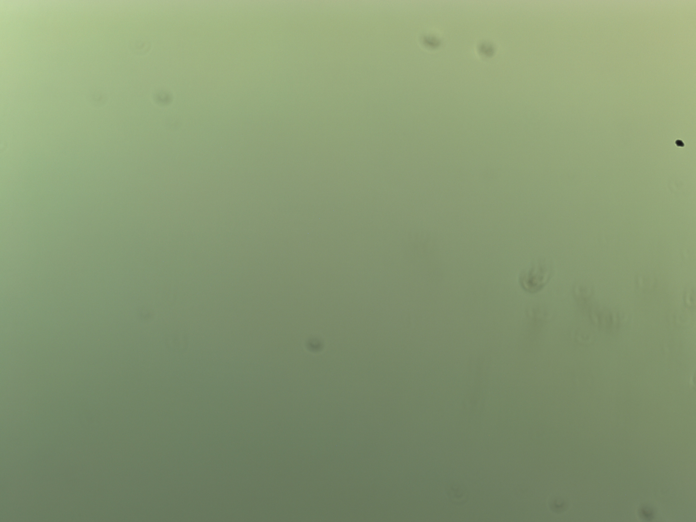

# senior-design-project-28-wafer-defect-detection
This project aims to process a 2D image taken from a microscope (and eventually from a 3D printer design wafer defect
detecting system) in order to find all wafer defects and their corresponding locations. There are three Python scripts 
located in this repository, which will be discussed individually below.

The first script, preprocess_images.py, will convert wafer images located in the directory titled
"defective" into a black and white image. This will occur by first converting the image into a grayscale format, 
then removing the gradient and camera lens particles, which you can see in the directory titled "clean", and converting
the image into a black and white format based on a predetermined threshold value.

The second script, stats.py, will identify all wafer defects on said black and white image and then display 
relevant statistics of the image on the console based on an image name provided by the user. Currently, the wafer defect
statistics that are being presented are the total number of pixels and defective pixels on the image, the percentage of
defective pixels to total pixels, the count of how many defects there are on the image, and how long it takes for the
statistical analysis to be generated. Future statistics that we would like to display are the locations of each defect,
the size of the biggest defect, and others.

The last script, cnn.py, is currently in work-in-progress. It aims to classify wafer defects based on a neural network
called a Convolutional Neural Network. However, since this is one of the last priorities of the project, this is not
currently in active development; rather, it will be worked on once we are able to generate all relevant statistics
discussed above.

Disclaimer: Preprocessing does not work very well for 50X and 100X magnification images, but works as expected on all 
other magnifications.

Below are images of a clean wafer, a defective wafer before processing and after processing, and statistics of that 
image printed to the console.

# Clean wafer image

# Defective wafer before processing image

# Defective wafer after processing image

# Console output
Welcome to the wafer image defect statistical generator!\
What image magnification would you like to see statistics of? (5X, 10X, 20X)\
20x\
You entered a magnification of 20X.\
What image would you like to generate statistics of?\
OX9 quadrant3 20X take1.jpg\
Generating statistics of OX9 QUADRANT3 20X TAKE1.JPG...\
Number of pixels in image: 10017440\
Number of defect pixels in image: 29166\
Percentage of defect pixels in image: 0.29%\
Number of defects in image: 4\
Total time: 1.63 seconds\
Exit? (Y/N)\
y

